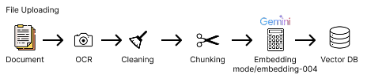
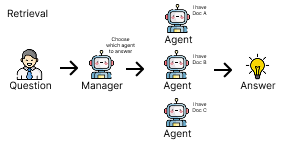

# WRITEUP: Architecture & Flow of RAG Web UI

## 1. Main Architecture

- **Backend**: FastAPI
  - Endpoints for upload, retrieve, answer, document management
  - ChromaDB integration (vector store)
  - Google Gemini integration (embeddings & generation)
  - Text extraction (PyPDF2, Gemini Vision OCR)
- **Frontend**: React (Vite)
  - Document upload, Chatbot, Document Manager
  - Consumes backend REST API
- **Storage**: ChromaDB (persistent at `data/chroma`)
- **OCR**: Google Gemini Vision (optional, for scanned PDFs)

## 2. Data Flow (RAG Pipeline)

1. **Document Upload**
   
   
   - User uploads file (PDF/TXT/MD) → backend saves file
   - Text extraction (OCR if selected)
   - Text chunking (recursive/sentence/paragraph)
   - Embedding (Google Gemini)
   - Store vectors in ChromaDB (per document, with filename metadata)

2. **Question Answering (RAG)**

    
   - User selects document & asks a question
   - Backend retrieves top-k relevant chunks from ChromaDB
   - Prompt + context sent to Google Gemini for answer generation
   - Answer & source chunks returned to user

3. **Document Management**
   - List documents, search by filename
   - Delete document (removes all related chunks from ChromaDB)

## 3. Implementation Notes
- **ChromaDB**: Used for vector storage, per-document collections, persisted on disk
- **Google Gemini**: Used for embedding (`gemini-embedding-001`) & generation (`gemini-2.0-flash-lite`)
- **OCR**: Falls back to PyPDF2 if OCR fails or is not selected
- **Configuration**: Can be set via `src/api/config.yaml` or environment variables
- **WebUI**: Built automatically during Docker build if Node/NPM is available

## 4. Development & Testing
- Modular structure: `src/modules/` for backend, `src/webui/` for frontend
- Testing: pytest for backend, dev server for frontend
- Data & models are not bundled; Gemini API key required

## 5. Limitations & Suggestions
- OCR is only for PDFs; results depend on scan quality
- Gemini API is paid and rate-limited
- No user authentication (can be added if needed)

---
For endpoint details & usage, see README.md.

